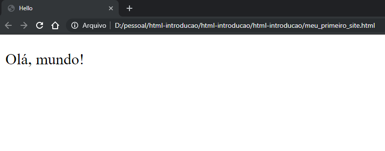

# html-introducao
Introdução ao HTML

# O que é HTML?
É uma linguagem utilizada para construção de páginas na web, sendo uma linguagem de programação e marcação de texto

# Criando sua primeira página
Digite o código abaixo em algum editor de texto (bloco de notas, notepad++, sublime, etc) e Salve o arquivo com o nome `meu_primeiro_site.html`

~~~html
<!DOCTYPE html>
<html>
 
    <head>
 
        <title>Hello</title>
 
    </head>
    
    <body>
 
        
Olá, mundo!

    
    </body>
 
</html>
~~~

Resultado:
